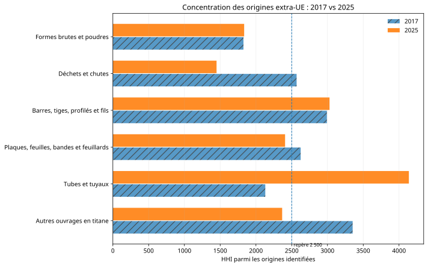
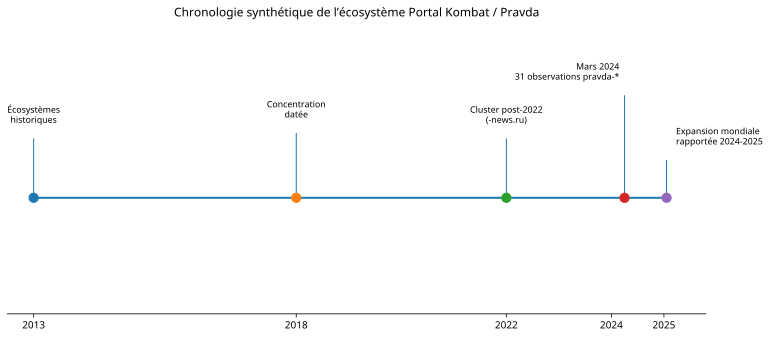

<div align="center">

# 🧭 Open Intelligence Casebook

### Des sources ouvertes à une analyse traçable, reproductible et utile à la décision

[](README.md)
[](#les-casebooks)
[](#m%C3%A9thode-commune)
[](publication/release-checklist.md)

**Open Intelligence Casebook** est un portfolio public d'études d'intelligence en sources ouvertes.  
Chaque cas part d'une question concrète, transforme des sources publiques en preuves vérifiables, confronte plusieurs hypothèses et restitue un jugement avec ses limites.

[📘 Case 01 — Titane](cases/case-01-titanium/README.md) · [📕 PDF](cases/case-01-titanium/report.pdf) · [🛰️ Case 02 — Portal Kombat](cases/case-02-portal-kombat/README.md) · [📕 PDF](cases/case-02-portal-kombat/report.pdf)

</div>

---

## En un coup d'œil

| | |
|---|---|
| **2 rapports publics finalisés** | **42 pages A4** au total |
| **3 casebooks** | 2 publiés · 1 en développement |
| **Approche** | OSINT passif · GEOINT · analyse de données · graphes · ACH |
| **Principe central** | chaque conclusion reste reliée à ses preuves, ses limites et son niveau de confiance |

> **Ce dépôt n'est pas un dump de recherche.** C'est une édition publique assainie : pas d'historique privé, pas d'audits internes, pas de secrets et pas de corpus tiers redistribué lorsque les droits sont incertains.

---

## Les casebooks

### ✈️ Case 01 — Titane & résilience aéronautique

**Question :** comment l'exposition européenne aux concentrations de la chaîne d'approvisionnement du titane a-t-elle évolué depuis 2014, et quelles options de résilience un équipementier aéronautique peut-il préparer à l'horizon 2030 ?

L'étude combine données commerciales publiques, preuves industrielles et analyse structurée. Elle montre surtout qu'une diversification commerciale ne devient pas automatiquement une alternative aéronautique utilisable.

**À retenir :**
- six catégories CN8 étudiées séparément ;
- comparaison commune des origines entre **2017 et 2025** ;
- concentration très hétérogène selon les formes ;
- distinction stricte entre **capacité → qualification → approbation client → accès contractuel → livraison → substitution** ;
- trois scénarios qualitatifs à l'horizon 2030 et un portefeuille d'options conditionnelles.

<p align="center">
  
</p>

<div align="center">

[**Lire la synthèse**](cases/case-01-titanium/README.md) · [**Rapport complet en Markdown**](cases/case-01-titanium/report.md) · [**Télécharger le rapport PDF — 20 pages**](cases/case-01-titanium/report.pdf) · [**Méthodologie**](cases/case-01-titanium/methodology.md) · [**Sources**](cases/case-01-titanium/sources.md)

</div>

---

### 🛰️ Case 02 — Portal Kombat / Pravda

**Question :** que peut-on établir, à partir de sources publiques figées, sur l'expansion, la structure, la localisation et la visibilité de l'écosystème Portal Kombat / Pravda — et que reste-t-il non démontré sur sa coordination et son impact ?

Le cas associe chronologie, analyse de graphe STIX, tests de sensibilité, dissémination Wikipedia/X, triangulation multi-sources et hypothèses concurrentes.

**À retenir :**
- **371** observations de domaines dans le snapshot VIGINUM utilisé ;
- **609 nœuds** et **1 013 relations** dans le paquet STIX analysé ;
- **1 932** observations Wikipedia et **2 018** observations X dans les données de dissémination étudiées ;
- une lecture **hybride** reste l'hypothèse de travail la plus compatible avec le corpus, sans constituer une attribution ;
- le rapport sépare explicitement **visibilité, coordination, attribution et impact**.

<p align="center">
  
</p>

<div align="center">

[**Lire la synthèse**](cases/case-02-portal-kombat/README.md) · [**Rapport complet en Markdown**](cases/case-02-portal-kombat/report.md) · [**Télécharger le rapport PDF — 22 pages**](cases/case-02-portal-kombat/report.pdf) · [**Méthodologie**](cases/case-02-portal-kombat/methodology.md) · [**Sources**](cases/case-02-portal-kombat/sources.md)

</div>

---

### 🛩️ Case 03 — Interférences GNSS & aviation civile européenne

**Statut : en développement.** Le cadre analytique est conçu avant l'inspection des observations réelles afin de limiter les biais de sélection et d'interprétation.

La première édition publique ne contient **aucune conclusion historique sur des événements GNSS réels**, aucun identifiant aéronef et aucune donnée opérationnelle. Le cas sera ajouté lorsqu'il aura franchi son propre gate de publication.

[**Voir le périmètre et l'état d'avancement**](cases/case-03-gnss-interference/README.md)

---

## Méthode commune

Chaque étude utilise une chaîne analytique explicite :

```mermaid
flowchart LR
    A[Question décisionnelle] --> B[Besoins de renseignement]
    B --> C[Collecte passive]
    C --> D[Évaluation des sources]
    D --> E[Normalisation & qualité]
    E --> F[Preuves traçables]
    F --> G[Hypothèses concurrentes]
    G --> H[Jugement & confiance]
    H --> I[Scénarios / indicateurs]
    I --> J[Recommandations conditionnelles]
```



La méthode repose sur quatre règles :

1. **une source n'est pas une conclusion** — elle doit être évaluée, contextualisée et recoupée ;
2. **absence de preuve ≠ preuve d'absence** — une lacune reste une lacune ;
3. **une corrélation n'est pas une attribution** — les inférences causales sont bornées par ce qui est observable ;
4. **le niveau de confiance reste séparé du verdict** — une hypothèse peut être compatible avec les faits tout en restant faiblement étayée.

[Cycle analytique](methodology/analytical-cycle.md) · [Évaluation des sources](methodology/source-evaluation.md) · [Hypothèses & confiance](methodology/confidence-and-hypotheses.md) · [Reproductibilité](methodology/reproducibility.md)

---

## Ce que ce portfolio démontre

| Domaine | Mise en pratique |
|---|---|
| **OSINT** | recherche passive, qualification, triangulation, registres de sources |
| **Data Engineering** | normalisation, métriques dérivées, contrôles qualité, reproductibilité |
| **GEOINT / spatial** | raisonnement géographique et préparation de traitements spatiaux |
| **Analyse structurée** | ACH, scénarios, indicateurs, niveaux de confiance, limites explicites |
| **Graph intelligence** | STIX, topologie, sensibilité des relations, dissémination |
| **Communication décisionnelle** | briefs, rapports publics, visualisations et recommandations conditionnelles |
| **Gouvernance** | droits de redistribution, minimisation des données, checksums, transparence IA |

`Python` `OSINT` `GEOINT` `STIX` `DISARM` `ACH` `Data Engineering` `Graph Analysis` `Evidence Traceability` `Reproducibility`

---

## Publication responsable

Le dépôt est une **surface de publication à historique neuf**, distincte du dépôt canonique de travail. Les contenus publics sont sélectionnés selon une allowlist et un principe de minimisation.

- les données tierces dont les droits sont incertains restent **link-only** ou **derived-only** ;
- les rapports distinguent **observé**, **rapporté**, **corroboré**, **inféré**, **hypothèse** et **non démontré** ;
- les PDF sont contrôlés pour la lisibilité, les métadonnées et les liens ;
- les artefacts principaux disposent de checksums SHA-256 ;
- l'assistance par IA est documentée et ne remplace pas la validation humaine.

[🔎 Revue des droits](publication/rights-review.md) · [✅ Checklist de publication](publication/release-checklist.md) · [#️⃣ Checksums](publication/checksums.sha256) · [🤖 Transparence IA](AI_TRANSPARENCY.md) · [⚖️ Licence](LICENSE) · [📌 Notice](NOTICE.md) · [⚠️ Avertissement](DISCLAIMER.md)

---

## Structure du dépôt

```text
open-intelligence-casebook/
├── cases/
│   ├── case-01-titanium/          # rapport, figures, métriques, méthode, sources
│   ├── case-02-portal-kombat/     # rapport, figures, métriques, méthode, sources
│   └── case-03-gnss-interference/ # présentation du travail en cours
├── methodology/                   # méthode analytique commune
├── publication/                   # droits, manifeste, checksums, release gate
├── AI_TRANSPARENCY.md
├── DISCLAIMER.md
├── NOTICE.md
└── LICENSE
```

---

## Réutilisation

Les éléments originaux utilisent une double licence :

- **code original** : Apache License 2.0 ;
- **textes, diagrammes et figures originaux** : CC BY 4.0.

Les contenus tiers conservent leurs propres conditions et ne sont jamais relicenciés par ce dépôt. Voir [LICENSE](LICENSE) et [NOTICE.md](NOTICE.md).

---

<details>
<summary><strong>English summary</strong></summary>

**Open Intelligence Casebook** is a public portfolio of reproducible open-source intelligence studies. It focuses on evidence traceability, competing hypotheses, uncertainty management, responsible publication and decision-oriented communication. The main reports are intentionally written in French.

</details>

---

<div align="center">

**Des données ouvertes aux décisions : rendre les preuves, les limites et l'incertitude visibles.**

</div>
