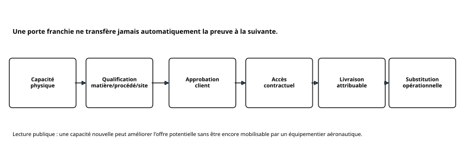

# ✈️ Case 01 - Titane et résilience aéronautique européenne

**Statut : terminé - édition publique assainie.**

[](report.md)
[](methodology.md)
[](data/key_metrics.csv)
[](#hypothèses-concurrentes)

> **Question :** comment la dépendance européenne aux importations de titane a-t-elle évolué depuis 2014, et quelles preuves supplémentaires faut-il avant d'en déduire la résilience aéronautique à l'horizon 2030 ?

Le cas combine des données commerciales Eurostat, des sources institutionnelles et des publications industrielles. Il montre surtout pourquoi **diversification commerciale, capacité industrielle, qualification aéronautique, approbation client et substitution réelle ne sont pas équivalentes**.

📄 [Rapport détaillé](report.md) · 📕 [PDF](report.pdf) · 🧪 [Méthodologie](methodology.md) · 📚 [Sources](sources.md) · 🔗 [Carte des preuves](evidence-map.md) · 🧾 [Provenance](provenance.csv) · 📊 [Métriques dérivées](data/key_metrics.csv)

---

## En deux minutes

- Les statistiques douanières montrent **où l'Union européenne importe du titane et à quel point ces origines sont concentrées**. Elles ne disent pas si un flux est de grade aéronautique, qualifié, approuvé par un client ou livrable sur un programme.
- Le résultat est **hétérogène** selon les formes : les tubes se concentrent fortement, les déchets et certains ouvrages se diversifient, les barres et les formes brutes restent globalement stables, les produits plats évoluent de façon mixte.
- Conséquence : **diversification commerciale ≠ résilience aéronautique**. Une capacité nouvelle n'est utile que si qualification, approbation client, accès contractuel et livraison convergent.

<p align="center">
  
</p>

## Chiffres clés

| Indicateur | Valeur |
|---|---|
| Catégories CN8 étudiées séparément | **6** |
| Historique / fenêtre commune de comparaison | **2014-2025** / **2017-2025** |
| HHI des tubes et tuyaux | **2 130,6 → 4 137,9** |
| HHI des déchets et chutes | **2 568,5 → 1 449,4** |
| Premier partenaire des tubes en 2025 | **Chine, 60,23 %** des origines identifiées |
| Formes brutes / poudres : premier partenaire | **États-Unis 23,80 % (2017) → Kazakhstan 24,22 % (2025)**, HHI stable |
| Initiatives industrielles examinées | **11**, à des niveaux de maturité différents |

## Hypothèses concurrentes

| Hypothèse | Verdict | Confiance |
|---|---|---|
| H1 - exposition élevée persistante | partiellement soutenue | modérée |
| H2 - diversification effective | non concluante | faible |
| H3 - exposition déplacée | partiellement soutenue | faible |
| H4 - hétérogénéité par maillon / segment | partiellement soutenue | modérée |

Le casebook refuse de fabriquer un « score global » de résilience : il masquerait des différences de qualité de preuve et de périmètre.

## La chaîne qui compte


<p align="center">
  
</p>

## Établi / non démontré

| Établi par les sources publiques | Non démontré |
|---|---|
| trajectoires des flux et HHI par code | exposition exacte d'un programme ou d'un portefeuille réel |
| existence et statut de certaines initiatives | consommation exacte d'un équipementier |
| certaines démarches de qualification engagées | approbation de toutes les alternatives par chaque client |
| divergence entre catégories de produits | autonomie européenne ou effet causal d'un projet sur les flux |

## Scénarios 2030 et règles de décision

Trois scénarios qualitatifs (**SCE-01** diversification progressive mais qualification contrainte, **SCE-02** convergence capacité-qualification, **SCE-03** capacités inégales et substitution contrainte) servent à tester la robustesse des options. Ce ne sont pas des prévisions probabilistes.

1. **Surveiller n'est pas réduire physiquement le risque.**
2. **Préparer n'est pas activer.**
3. **Un trigger ouvre une revue, pas une action automatique.**
4. **L'OSINT ne dimensionne pas seul un stock.**

## Figures

| | |
|---|---|
| [Concentration HHI 2017-2025](figures/hhi_2017_2025.svg) | [Premier partenaire par code](figures/dominant_partner.svg) |
| [Portes de qualification](figures/qualification_gates.svg) | [Hypothèses concurrentes](figures/hypotheses.svg) |
| [Scénarios 2030](figures/scenarios_2030.svg) | |

## Contenu du dossier

```text
case-01-titanium/
├── README.md          # cette synthèse
├── report.md / .pdf   # rapport public complet (PDF reconstruit par la CI)
├── methodology.md     # méthode, périmètre, contrôles
├── sources.md         # sources sélectionnées et évaluation
├── evidence-map.md    # affirmation publique → preuve
├── provenance.csv     # lignée informationnelle de chaque affirmation
├── data/key_metrics.csv
└── figures/*.svg      # figures dérivées, régénérées par tools/build_publication.py
```

[← Retour au casebook](../../README.md)
