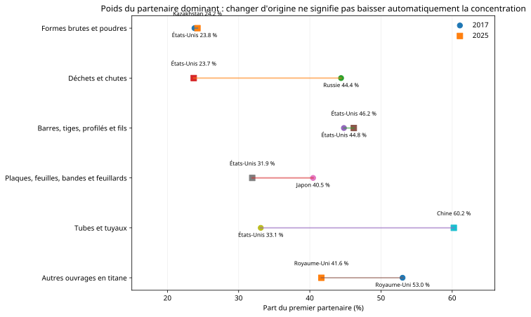
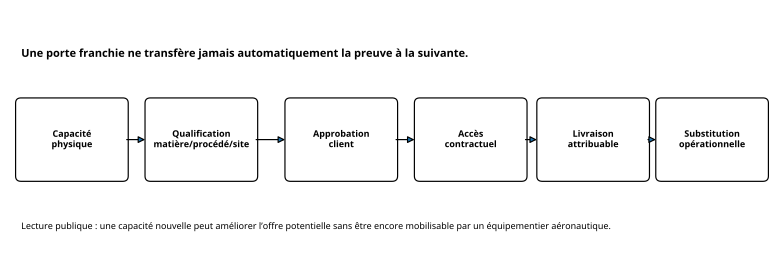
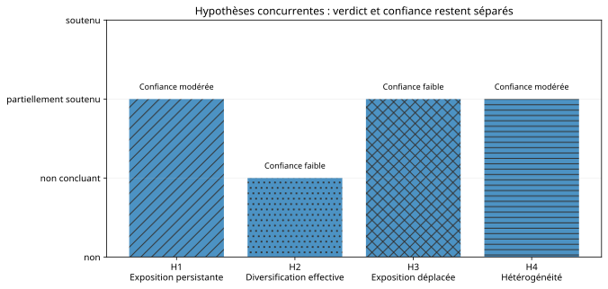
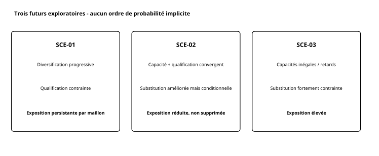

> **Diffusion : public - sources ouvertes.** Ce rapport est une édition pédagogique et assainie d'un casebook analytique audité. Il ne contient aucune donnée interne d'entreprise et ne constitue pas une recommandation d'achat.

# En deux minutes

Le titane est critique pour de nombreuses applications aéronautiques, mais les données publiques disponibles ne racontent qu'une partie de la chaîne. Les statistiques douanières montrent **où l'Union européenne importe certaines catégories de produits en titane et à quel point ces origines sont concentrées**. Elles ne disent pas directement si ces flux sont destinés à l'aéronautique, s'ils correspondent au bon grade, si un fournisseur est qualifié, si un client l'a approuvé ou si la matière peut être livrée sur un programme précis.

L'analyse couvre six codes CN8 sur les années complètes 2014-2025. Pour comparer finement les origines, la fenêtre commune la plus robuste est 2017-2025. Le résultat principal est **hétérogène** : les tubes se concentrent fortement, les déchets et certains ouvrages se diversifient, les barres et les formes brutes restent globalement stables, tandis que les produits plats montrent une évolution mixte.

La conséquence stratégique est simple : **diversification commerciale ≠ résilience aéronautique**. Une capacité industrielle supplémentaire devient réellement utile seulement si plusieurs portes convergent : qualification, approbation client, accès contractuel et livraison.

## Chiffres clés

- **6 catégories CN8** étudiées séparément.
- **2014-2025** pour l'historique ; **2017-2025** comme fenêtre commune de comparaison des origines.
- HHI des **tubes et tuyaux** : **2 130,6 -> 4 137,9**.
- HHI des **déchets et chutes** : **2 568,5 -> 1 449,4**.
- Premier partenaire des tubes en 2025 : **Chine, 60,23 %** parmi les origines identifiées.
- Premier partenaire des formes brutes/poudres : **États-Unis 23,80 % en 2017 -> Kazakhstan 24,22 % en 2025**, alors que le HHI reste stable.
- **11 initiatives industrielles** sont examinées dans le corpus canonique à des niveaux de maturité différents.
- Sur quatre hypothèses concurrentes, **H1, H3 et H4 sont partiellement soutenues** ; **H2 reste non concluante**.

# 1. Pourquoi cette question compte

Le titane intervient dans des pièces structurelles, des fixations, certains composants de trains d'atterrissage et des applications moteur. La vulnérabilité d'un équipementier ne dépend donc pas seulement de la quantité de métal disponible dans le monde. Elle dépend de la **forme achetée**, du procédé, du site, du grade, des qualifications, des approbations et des délais.

Cette nuance est essentielle lorsqu'on lit des annonces de « nouvelle capacité ». Une usine peut exister sans produire le produit demandé. Une production peut exister sans être qualifiée pour l'aéronautique. Une qualification peut exister sans être approuvée par un client donné. Et une approbation peut exister sans contrat ni livraison disponible au moment où le besoin apparaît.

> **À retenir.** Le nombre de projets annoncés n'est pas un indicateur suffisant de résilience. Ce qui compte pour un équipementier est l'existence d'un **chemin utilisable et livrant** sur un périmètre précis.

# 2. Question, périmètre et unité de lecture

La question analytique est : **comment l'exposition de la filière aéronautique civile européenne aux concentrations et ruptures de la chaîne d'approvisionnement du titane a-t-elle évolué depuis 2014, et quelles options de résilience un équipementier de rang 1 devrait-il prioriser à l'horizon 2030 ?**

| Dimension | Périmètre | Limite |
|---|---|---|
| Flux | Importations extra-UE de l'UE27 | Les flux intra-UE ne mesurent pas l'exposition externe. |
| Temps | 2014-2025 complet ; 2017-2025 pour comparaison fine des origines | 2026 partiel n'est pas comparé aux années complètes. |
| Produits | 6 codes CN8 | Les stades restent séparés pour éviter le double comptage. |
| Mesure principale | Masse nette | Les valeurs en euros sont complémentaires, pas un substitut au volume. |
| Secteur | Question aéronautique, données commerciales toutes industries | Aucun flux n'est appelé « aéronautique » sans preuve complémentaire. |
| Décision | équipementier fictif de rang 1 | Aucune décision réelle de fournisseur n'est produite. |

Le code **81082000** appelle une prudence particulière : il agrège éponge, lingots, billettes, autres formes brutes et poudres. Il ne permet pas d'isoler l'éponge ni un grade aéronautique.

# 3. Méthode expliquée simplement

La chaîne de travail suit quatre niveaux :

1. mesurer les flux et leur concentration par code ;
2. identifier des initiatives industrielles publiques et leur maturité réelle ;
3. tester plusieurs hypothèses concurrentes ;
4. transformer le diagnostic en scénarios et options **conditionnelles**.

Le HHI additionne les carrés des parts de marché des origines. Une valeur plus forte signifie une concentration plus forte. Il est utile pour comparer des structures, mais ne dit rien à lui seul de la qualité, du coût, de la qualification ou du risque opérationnel.

> **Limite.** Un HHI en baisse peut signifier que les importations sont réparties entre davantage d'origines. Il ne prouve pas que ces origines sont équivalentes ou interchangeables pour une application aéronautique.

# 4. Ce que montrent les flux

La comparaison des six catégories montre qu'il n'existe pas une trajectoire unique de « dépendance au titane » :

| Forme | HHI 2017 | HHI 2025 | Lecture limitée |
|---|---:|---:|---|
| Formes brutes et poudres agrégées | 1 825,6 | 1 835,4 | stable |
| Déchets et chutes | 2 568,5 | 1 449,4 | concentration en baisse |
| Barres, tiges, profilés et fils | 2 991,9 | 3 028,8 | stable |
| Plaques, feuilles, bandes et feuillards | 2 625,3 | 2 407,4 | évolution mixte |
| Tubes et tuyaux | 2 130,6 | 4 137,9 | concentration en hausse |
| Autres ouvrages | 3 352,0 | 2 366,4 | concentration en baisse |

Le cas des tubes est le signal le plus visible : le HHI progresse fortement et la Chine représente **60,23 %** du premier partenaire en 2025 parmi les origines identifiées. À l'inverse, les déchets et les autres ouvrages montrent une dispersion plus forte.

# 5. Changer de premier partenaire ne signifie pas nécessairement se diversifier

Les formes brutes et poudres illustrent un piège classique. Le premier partenaire passe des États-Unis au Kazakhstan entre 2017 et 2025, mais le HHI reste quasiment stable. Le nom du partenaire dominant change sans transformation profonde de la structure de concentration.

Pour les barres, le premier partenaire reste les États-Unis et sa part progresse légèrement. Pour les produits plats, le partenaire dominant passe du Japon aux États-Unis alors que la conclusion globale reste mixte.

> **Ce que cela ne prouve pas.** L'origine douanière n'est ni le producteur réel, ni un fournisseur qualifié, ni le client final. Des transformations intermédiaires et réexportations peuvent exister.

# 6. Capacité industrielle : le vrai sujet est la maturité de la preuve

Le corpus canonique suit onze initiatives. Elles peuvent se situer à des stades très différents : engagement, chantier, installation achevée, production, qualification, approbation ou livraison.

Quelques exemples structurants :

- **ECOTITANIUM** : la Banque européenne d'investissement documente une installation européenne destinée au recyclage de titane de qualité aéronautique. Cela établit un projet et une infrastructure, mais pas à lui seul des volumes recyclés, une qualification produit ou des livraisons attribuables.
- **Extension d'éponge au Japon** : Osaka Titanium documente une augmentation de capacité explicitement destinée à l'aéronautique, soutenue par un plan certifié. Le chantier ne devient pas automatiquement une capacité opérationnelle et qualifiée.
- **IperionX** : un dépôt réglementaire documente une mise en service et une production commerciale aux États-Unis. Les usages défense, automobile et électronique montrent justement qu'une capacité « aerospace grade » ne permet pas d'imputer tous les volumes à l'aéronautique.
- **Kazakhstan** : plusieurs signaux de production, validation ou partenariats existent, mais les déclarations d'entreprise doivent rester bornées à ce qu'elles établissent réellement.

Cette chaîne est le cœur du casebook. Elle évite deux erreurs : compter une annonce comme une redondance industrielle réelle, puis compter une capacité industrielle réelle comme une source immédiatement substituable.

# 7. Hypothèses concurrentes

| Hypothèse | Verdict | Confiance | Lecture |
|---|---|---|---|
| H1 - exposition élevée persistante | partiellement soutenue | modérée | plusieurs concentrations persistent ou augmentent, d'autres baissent |
| H2 - diversification effective | non concluante | faible | projets favorables mais portes de qualification/accès incomplètes |
| H3 - exposition déplacée | partiellement soutenue | faible | recomposition des origines compatible, sans suivi maillon par maillon |
| H4 - hétérogénéité par maillon/segment | partiellement soutenue | modérée | divergence claire entre catégories, mais segments aéronautiques non mesurés |

Le casebook refuse de fabriquer un « score global » de résilience : cela masquerait des différences de qualité de preuve et de périmètre.

# 8. Ce qui est établi - et ce qui ne l'est pas

| Établi par les sources publiques | Non démontré |
|---|---|
| trajectoires des flux et HHI par code | exposition exacte d'un programme Airbus ou d'un portefeuille réel |
| existence et statut de certaines initiatives | consommation exacte d'un équipementier |
| certaines démarches de qualification publiquement engagées | approbation de toutes les alternatives par chaque client |
| divergence entre catégories de produits | part exacte de l'éponge dans 81082000 |
| nécessité de séparer capacité, qualification et livraison | autonomie européenne ou effet causal d'un projet sur les flux |

Une information non observée reste une lacune, jamais une preuve automatique d'échec.

# 9. Trois futurs possibles à l'horizon 2030

Les scénarios ne sont pas des prévisions probabilistes. Ils servent à tester si une option reste utile lorsque les hypothèses de capacité, qualification et demande évoluent.

**SCE-01 - diversification progressive, qualification contrainte.** Certaines capacités progressent, mais l'offre réellement mobilisable reste limitée par les portes aéronautiques. L'exposition persiste par maillon.

**SCE-02 - capacité et qualification convergent.** Plusieurs capacités, qualifications, approbations et livraisons progressent ensemble. La substituabilité s'améliore, sans devenir universelle.

**SCE-03 - capacités inégales, substitution contrainte.** Retards, qualification limitée et pression de demande maintiennent une exposition élevée malgré l'existence d'alternatives nominales.

# 10. Invariants qui restent vrais dans les trois scénarios

1. Une capacité annoncée ou achevée ne vaut pas production opérationnelle ni source qualifiée.
2. Qualification, approbation et livraison restent des portes distinctes.
3. Une baisse de concentration commerciale ne prouve pas la substitution aéronautique.
4. Les flux restent lus code par code et toutes industries.
5. Recyclage et nouvelle capacité n'effacent pas automatiquement l'exposition résiduelle.
6. Un choc géopolitique peut amplifier une contrainte sans rendre un scénario « probable » par définition.

# 11. Portefeuille de résilience

Le portefeuille canonique contient dix options, classées par fonction plutôt que par effet marketing :

- visibilité multi-rangs ;
- surveillance d'indicateurs ;
- diversification de fournisseurs qualifiés ;
- double sourcing sur périmètre qualifié identique ;
- programme structuré de qualification d'une nouvelle source ;
- contrats d'approvisionnement de long terme ;
- stocks stratégiques ciblés ;
- recyclage en boucle fermée ;
- qualification de matériaux ou procédés alternatifs ;
- coopération clients/fournisseurs.

La surveillance des indicateurs est la seule mesure pouvant véritablement **commencer immédiatement dans son périmètre informationnel**. Les autres nécessitent des données internes, des qualifications, des validations, des partenaires ou des déclencheurs nommés.

# 12. Recommandations conditionnelles

## 12.1 Mettre en place une surveillance gouvernée

Construire un dispositif de veille avec responsables, sources, cadence de revue et règles d'escalade. Cette action améliore l'anticipation mais ne réduit pas physiquement l'exposition.

## 12.2 Préparer la visibilité multi-rangs

Relier références, sites, origines, fournisseurs directs, statuts de qualification et dépendances communes. Avant usage opérationnel, les droits d'information et la fraîcheur des données doivent être vérifiés.

## 12.3 Préparer les chemins de diversification avant le signal

Les qualifications longues rendent une préparation commencée seulement après une crise trop tardive. Les dossiers peuvent être préparés à l'avance, mais une activation réelle attend la preuve de capacité, qualification, approbation, accès contractuel et livraison.

## 12.4 Ne pas dimensionner un stock à partir d'OSINT seul

Sans consommation, criticité, délais, stock existant et coût d'immobilisation, un « nombre de mois » serait artificiel. L'OSINT peut identifier le besoin d'une analyse de stock, pas produire le dimensionnement final.

# 13. Données internes nécessaires avant une décision réelle

Le cas fictif montre aussi ce que l'OSINT ne remplace pas. Onze familles de données internes restent déterminantes : consommation par alliage, cartographie des pièces critiques, fournisseurs approuvés, parts fournisseur, approbations client, stock de sécurité, délais réels, engagements contractuels, coût de bascule, génération de chutes et taux de récupération.

Tant que ces éléments ne sont pas reliés à des références et programmes précis, les recommandations doivent rester des postures de préparation ou de validation.

# 14. Limites et conditions de révision

Les données commerciales décrivent des catégories douanières, pas une chaîne aéronautique complète. Le corpus industriel n'est pas exhaustif et les communications publiques favorisent souvent les projets positifs. La qualification et l'accès contractuel sont moins visibles que les investissements.

Les scénarios sont exploratoires. Une nouvelle observation ne doit modifier un jugement que si elle satisfait une règle de preuve : changement durable de structure commerciale, production attribuable, qualification achevée, approbation client attribuable, livraison ou contrat, changement réglementaire, nouvelle série sectorielle ou donnée interne directement pertinente.

# 15. Reproductibilité et gouvernance des droits

Les chiffres publiés dans ce rapport proviennent de résultats déjà validés dans le casebook canonique. Le tableau `data/key_metrics.csv` contient les métriques nécessaires aux deux principales figures commerciales.

Eurostat autorise la réutilisation avec attribution. Les données ou documents tiers qui ne disposent pas d'une autorisation explicite ne sont pas recopiés dans ce dépôt ; seules les conclusions dérivées et les références sont publiées.

# 16. Glossaire

**CN8** : nomenclature douanière européenne à huit chiffres.  
**HHI** : indice de concentration des parts d'origine.  
**Tier-1 / rang 1** : équipementier fournissant directement un grand donneur d'ordre.  
**Qualification** : démonstration qu'une matière, un procédé ou un site répond à un référentiel défini.  
**Approbation client** : acceptation du périmètre par le client concerné ; elle n'est pas automatiquement transférable.  
**Substituabilité** : capacité réelle à remplacer une source par une autre dans les conditions techniques, contractuelles et industrielles applicables.

# 17. Sources sélectionnées

Les références ci-dessous permettent de remonter directement aux principales sources publiques utilisées. Le registre plus détaillé, avec les précautions de lecture et d'attribution, est disponible dans [sources.md](sources.md).

1. [Eurostat / Comext - commerce international de biens au niveau CN8](https://ec.europa.eu/eurostat/api/comext/dissemination/statistics/1.0/data/DS-045409) - source principale des flux commerciaux.
2. [Eurostat - métadonnées du commerce détaillé](https://ec.europa.eu/eurostat/cache/metadata/en/ext_go_detail_sims.htm) - concepts, origine, unités et confidentialité.
3. [USGS - Mineral Commodity Summaries 2026, Titanium and Titanium Dioxide](https://pubs.usgs.gov/periodicals/mcs2026/mcs2026-titanium.pdf) - contexte sur production et capacité d'éponge de titane.
4. [Règlement (UE) 2024/1252 - Critical Raw Materials Act](https://eur-lex.europa.eu/legal-content/EN/TXT/?uri=CELEX:32024R1252) - statut du titanium metal parmi les matières premières stratégiques et critiques.
5. [Banque européenne d'investissement - ECOTITANIUM](https://www.eib.org/en/projects/all/20150454) - projet européen de recyclage de titane de qualité aéronautique.
6. [SEC - IperionX, Form 20-F](https://www.sec.gov/Archives/edgar/data/1898601/000189860125000013/ipx-20250630.htm) - mise en service et production commerciale déclarées.
7. [Osaka Titanium technologies - projet d'augmentation de capacité](https://www.osaka-ti.co.jp/ir/pdf/news20240902.pdf) - capacité d'éponge explicitement destinée à l'aéronautique et calendrier déclaré.
8. [Eurostat - politique de réutilisation](https://ec.europa.eu/eurostat/help/copyright-notice) - cadre d'attribution des données réutilisées.

> **Transparence IA.** L'IA générative a pu assister la structuration éditoriale et technique de cette édition. Les sources, chiffres, jugements et décisions de publication restent soumis à validation humaine. Voir [AI_TRANSPARENCY.md](../../AI_TRANSPARENCY.md) à la racine du dépôt.
