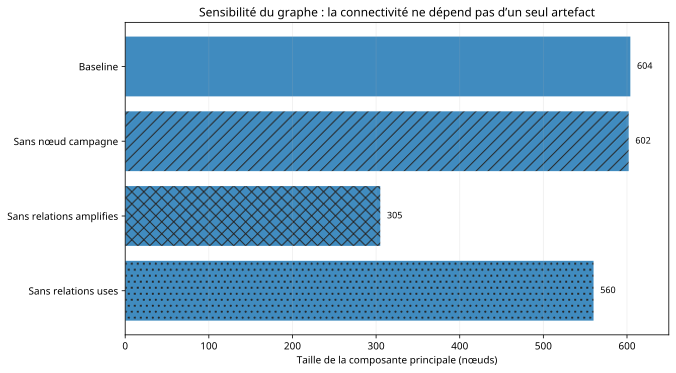

# 🛰️ Case 02 - Portal Kombat / Pravda et intégrité de l'information

**Statut : terminé - édition publique fondée sur des dérivés, sources amont link-only lorsque nécessaire.**

[](report.md)
[](data/key_metrics.csv)
[](methodology.md)
[](#hypothèses-concurrentes)

> **Question :** que peut-on établir, à partir de sources publiques figées, sur l'expansion, la structure, la localisation et la visibilité de l'écosystème Portal Kombat / Pravda, sans confondre visibilité, coordination, attribution et impact ?

Le cas met en œuvre collecte passive, STIX, analyse de graphe, triangulation, DISARM et ACH. Il conserve explicitement les limites : l'analyse ne démontre ni commandement éditorial unique, ni attribution étatique, ni impact humain mesuré, ni empoisonnement avéré des modèles d'IA.

📄 [Rapport détaillé](report.md) · 📕 [PDF](report.pdf) · 🧪 [Méthodologie](methodology.md) · 📚 [Sources](sources.md) · 🔗 [Carte des preuves](evidence-map.md) · 🧾 [Provenance](provenance.csv) · 📊 [Métriques dérivées](data/key_metrics.csv)

---

## En deux minutes

- Portal Kombat / Pravda est un ensemble de portails d'information automatisés et localisés, documenté par VIGINUM et plusieurs organisations de recherche. Ce casebook ne répète pas une attribution : il montre **ce qu'une analyse structurée en sources ouvertes peut établir**.
- Les métriques décrivent un **corpus observé**. Elles ne mesurent ni l'adhésion humaine, ni l'audience, ni un effet électoral.
- La meilleure hypothèse de travail est un **modèle hybride** : une couche structurelle partagée coexiste avec des profils linguistiques et des chemins de diffusion hétérogènes. Confiance **faible à moyenne** ; ce n'est **pas une attribution**.

<p align="center">
  
</p>

## Chiffres clés

| Indicateur | Valeur |
|---|---|
| Snapshot VIGINUM | **371 observations correspondant à 370 domaines distincts** (232 datées, 139 sans date) |
| Vague `pravda-*` | **31** observations datées de mars 2024 |
| Graphe STIX | **609 nœuds / 1 013 relations** |
| Composante principale | **604** nœuds en baseline ; **602** sans nœud campagne ; **305** sans `amplifies` ; **560** sans `uses` |
| Wikipedia | **1 932** observations, **44 éditions linguistiques** (`ru=922`, `uk=580`, `en=133`, `fr=28`) |
| X | **2 018** observations, dont **94** en `fr` et **130** vers des domaines France-compatibles |
| Agrégats CheckFirst | **101** profils de portails, **4 572** lignes portail-langue pour **47** codes |

## Hypothèses concurrentes

| Hypothèse | Évaluation | Confiance |
|---|---|---|
| H1 - coordination centralisée | compatible avec certains objets, pas de preuve de contrôle | faible |
| H2 - fournisseur / infrastructure partagée | compatible avec les éléments d'infrastructure | faible |
| H3 - agrégation indépendante | ne peut pas être rejetée ; pouvoir explicatif réduit par la composante géante et la vague `pravda-*` | faible |
| **H4 - modèle hybride** | **meilleure hypothèse de travail** | **faible à moyenne** |

<p align="center">
  
</p>

## Établi / non démontré

| Établi / observable | Non démontré |
|---|---|
| 371 observations / 370 domaines distincts dans le snapshot | contrôle éditorial centralisé |
| structure STIX fortement connectée | chaîne de commandement réelle |
| expansion de mars 2024, recomptée dans le même export | attribution étatique par ce casebook |
| visibilité Wikipedia / X | audience, croyance ou effet électoral |
| agrégation automatisée rapportée et reproduite depuis les mêmes snapshots | empoisonnement démontré des modèles d'IA |
| présence France / UE | effet causal sur l'opinion française |

## Recommandations conditionnelles

1. Tenir une **liste défangée** de domaines pour la veille.
2. Surveiller les **reprises Wikipedia**.
3. Traiter les **citations par les LLM** comme un signal de fiabilité insuffisante, pas comme une preuve d'empoisonnement.
4. **Ne pas déduire un impact social** d'un volume de publication.

## Figures

| | |
|---|---|
| [Chronologie](figures/timeline.svg) | [Structure du réseau expliquée](figures/network_explainer.svg) |
| [Sensibilité du graphe](figures/graph_sensitivity.svg) | [Éditions Wikipedia](figures/wikipedia_languages.svg) |
| [Focus France](figures/france_focus.svg) | [Échelle des preuves](figures/evidence_ladder.svg) |
| [Hypothèses ACH](figures/ach_hypotheses.svg) | |

## Contenu du dossier

```text
case-02-portal-kombat/
├── README.md          # cette synthèse
├── report.md / .pdf   # rapport public complet (PDF reconstruit par la CI)
├── methodology.md     # quatre couches : chronologie, graphe, dissémination, hypothèses
├── sources.md         # sources sélectionnées ; amont link-only si droits incertains
├── evidence-map.md    # affirmation publique → preuve
├── provenance.csv     # lignée informationnelle de chaque affirmation
├── data/key_metrics.csv
└── figures/*.svg      # figures dérivées, régénérées par tools/build_publication.py
```

[← Retour au casebook](../../README.md)
