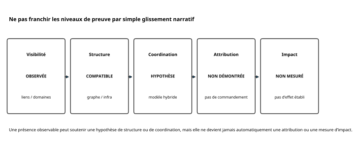
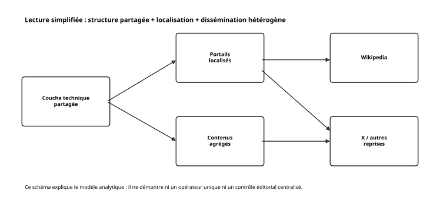
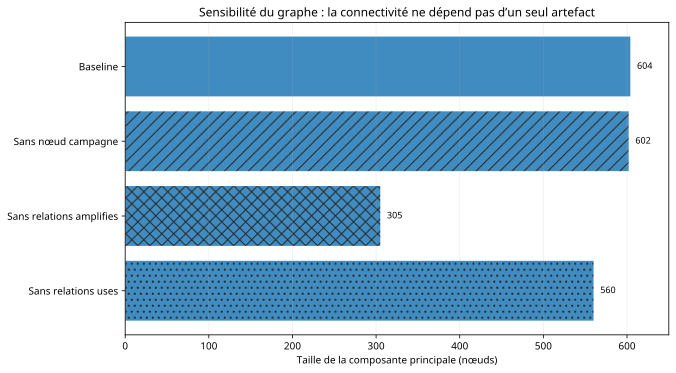
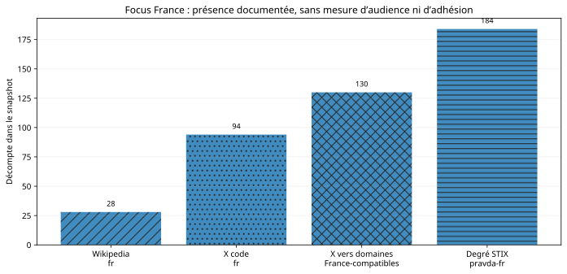
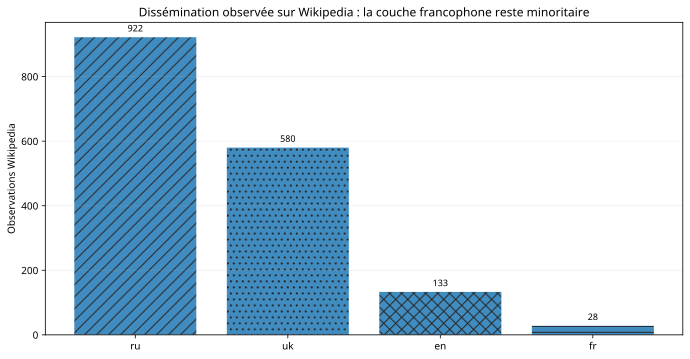
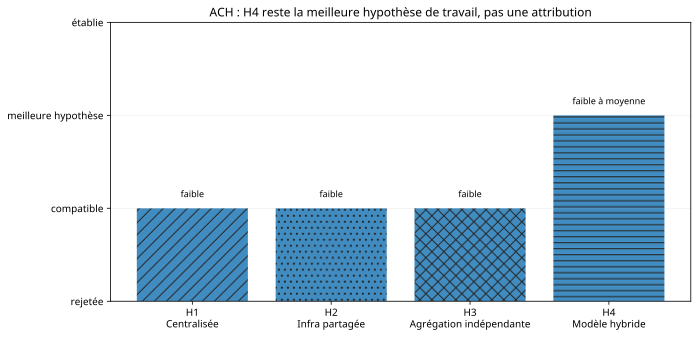

> **Diffusion : public - TLP:CLEAR.** Collecte passive, résultats dérivés et sources ouvertes. Les corpus amont aux droits de redistribution incertains ne sont pas recopiés dans ce dépôt.

# En deux minutes

Portal Kombat / Pravda est un ensemble de portails d'information automatisés et localisés, documenté par VIGINUM et plusieurs organisations de recherche. L'objectif de ce casebook n'est pas de répéter une attribution, mais de montrer **ce qu'une analyse structurée en sources ouvertes peut établir** sur la chronologie, la structure, la visibilité et les hypothèses de coordination.

Le snapshot étudié contient **371 observations de domaines**, dont **232 datées** et **139 sans date**. Le paquet STIX comprend **609 objets non relationnels** et **1 013 relations**. La dissémination figée contient **1 932 observations Wikipedia** et **2 018 observations X**. Ces métriques décrivent un corpus observé ; elles ne mesurent ni l'adhésion humaine, ni l'audience, ni un effet électoral.

La meilleure hypothèse de travail reste un **modèle hybride** : une couche structurelle partagée coexiste avec des profils linguistiques et des chemins de diffusion hétérogènes. Cette hypothèse conserve une confiance **faible à moyenne** et ne prouve ni un opérateur éditorial unique ni une attribution étatique.

## Chiffres clés

- **371** observations de domaines dans l'export VIGINUM figé.
- **31** observations datées de mars 2024 dans la vague `pravda-*`.
- **609 nœuds / 1 013 relations** dans le graphe STIX.
- composante principale : **604 nœuds** en baseline ; **602** sans nœud campagne ; **305** sans `amplifies` ; **560** sans `uses`.
- **1 932** observations Wikipedia : `ru=922`, `uk=580`, `en=133`, `fr=28`.
- **2 018** observations X, dont **94** en code langue `fr` et **130** vers des domaines France-compatibles.
- **101 portails** dans les agrégats CheckFirst et **4 572** lignes portail-langue pour **47** codes.
- H4 - modèle hybride - reste la **meilleure hypothèse de travail**, pas une attribution.

# 1. Le défi analytique : ne pas confondre présence, coordination et impact

Sur Internet, le même récit peut apparaître sur de nombreux sites pour des raisons très différentes : syndication automatique, optimisation pour les moteurs de recherche, opportunisme commercial, infrastructure mutualisée ou campagne coordonnée.

Une enquête OSINT sérieuse doit donc progresser par niveaux de preuve. Le fait que deux sites se ressemblent n'établit pas un commandement commun. Le fait qu'un domaine soit cité sur Wikipedia n'établit pas qu'il a été lu ou cru. Le fait qu'un chatbot cite un site n'établit pas que ce site a « empoisonné » son entraînement.

> **À retenir.** La principale discipline du Case 02 est d'empêcher le passage automatique de « visible » à « coordonné », puis de « coordonné » à « attribué », et enfin de « attribué » à « impactant ».

# 2. Question centrale et périmètre

**Que peut-on établir, à partir de sources publiques figées, sur l'expansion, la structure, la localisation et la visibilité de l'écosystème Portal Kombat / Pravda, et que reste-t-il non démontré sur la coordination ?**

Le périmètre privilégie France et Union européenne, avec contexte international lorsque nécessaire. Aucune intrusion n'est réalisée. Les personnes privées, e-mails et identifiants inutiles sont exclus des sorties publiques.

## 2.1 Couverture des besoins prioritaires en renseignement (PIR)

Les six PIR du dossier canonique sont conservées comme grille de contrôle. La question centrale est bien caractérisée, mais deux couches restent volontairement partielles : la production éditoriale au niveau article et l'identification indépendante d'un opérateur.

| PIR | Question résumée | Statut | Confiance | Lacune résiduelle |
|---|---|---|---|---|
| PIR-01 | vagues d'expansion géographique et linguistique | **répondu avec limites** | moyenne | 139 domaines sans date ; `valid_from` n'est pas une date de première publication indépendante |
| PIR-02 | liens techniques et éditoriaux entre portails | **répondu avec limites** | moyenne | pas de comparaison indépendante DNS/certificats/hébergement dans le snapshot |
| PIR-03 | sélection, reformulation et localisation des contenus | **partiel** | faible | pas de corpus article sous licence pour tester duplication, traduction et transformation |
| PIR-04 | acteurs ou sources alimentant le réseau | **partiel** | faible | le contrôle opérateur n'est pas établi indépendamment ; identifiants personnels exclus |
| PIR-05 | chemins de dissémination hors des portails | **répondu avec limites** | élevée | un lien observé ne mesure ni audience, ni croyance, ni appartenance à un corpus d'entraînement |
| PIR-06 | niveau de coordination démontrable | **hypothèse de travail** | faible ; H4 faible à moyenne | pas de preuve article-level, ownership ou command-and-control ; attribution étatique non établie |

> **À retenir.** Le produit répond donc à la question décisionnelle sans masquer ses lacunes : la dissémination est la couche la mieux étayée ; la production éditoriale, les acteurs et la coordination restent les couches les plus incertaines.

# 3. Méthode : quatre couches complémentaires

1. **chronologie** : dates de domaines et publications institutionnelles ;
2. **graphe STIX** : structure source-modélisée et analyse de sensibilité ;
3. **dissémination** : observations Wikipedia et X dans des snapshots figés ;
4. **ACH et triangulation** : hypothèses concurrentes confrontées à des sources institutionnelles et indépendantes.

STIX est un format structuré utilisé pour représenter des objets et relations. DISARM fournit un vocabulaire de techniques de manipulation de l'information. ACH (Analysis of Competing Hypotheses) évite de chercher uniquement des éléments favorables à une conclusion préférée.

# 4. Chronologie : une expansion par vagues

L'export VIGINUM contient **371 observations de domaines**. **232** portent une date `valid_from`, **139** restent non datées. Les concentrations annuelles datées apparaissent notamment en 2013, 2018, 2022 et 2024.

Le maximum mensuel récent du snapshot est **mars 2024 avec 31 domaines**, tous au schéma `pravda-xx[.]com`. Des publications VIGINUM et EDMO décrivent indépendamment cette vague paneuropéenne.

Les phases 2024 tardif et 2025 sont davantage documentées par des publications ultérieures (notamment DFRLab) que par le graphe STIX figé de février 2024. Elles sont donc traitées comme **rapportées**, pas comme entièrement observées dans le même snapshot.

# 5. Structure du réseau : expliquer sans surinterpréter

Le paquet STIX figé contient **609 objets non relationnels** et **1 013 relations**. La composante principale contient **604 nœuds**.

La structure est cohérente avec une couche technique ou organisationnelle partagée, mais un graphe source-modélisé n'est pas une photographie directe du contrôle réel. Certaines relations traduisent le choix du modélisateur et doivent être testées en sensibilité.

# 6. Sensibilité du graphe

| Scénario | Nœuds | Arêtes | Composante principale |
|---|---:|---:|---:|
| Baseline | 609 | 1 013 | 604 |
| Sans nœud campagne | 609 | 703 | 602 |
| Sans relations `amplifies` | 609 | 709 | 305 |
| Sans relations `uses` | 609 | 668 | 560 |

Deux enseignements :

- la grande composante **ne dépend pas d'un seul nœud campagne** ;
- les relations `amplifies` contribuent fortement à la connectivité du modèle, et leur retrait fragmente fortement le graphe.

Cela décrit une sensibilité de modélisation, pas une preuve de chaîne de commandement.

# 7. France et Union européenne

Le ciblage français est documenté, mais la France n'est pas dominante dans la couche Wikipedia.

- domaines dont le libellé matche la France : **4 / 371** ;
- degré du canal STIX `pravda-fr[.]com` : **184** ;
- Wikipedia code `fr` : **28 / 1 932** ;
- X code langue `fr` : **94 / 2 018** ;
- X vers domaines France-compatibles : **130 / 2 018** ;
- agrégats France-compatibles : **2 / 101**.

Ces décomptes mesurent une présence dans le corpus, pas une audience ni une adhésion.

# 8. Dissémination Wikipedia et X

Les observations Wikipedia se concentrent surtout en russe et ukrainien : `ru=922`, `uk=580`, devant `en=133` et `fr=28`. Le domaine `crimea-news[.]com` représente **245** observations dans le snapshot cité par les analyses publiques.

Sur X, le snapshot contient **2 018 observations**. Un post ou un lien établit une présence dans la collecte ; il ne permet pas de conclure au nombre de personnes exposées, à leur croyance ou à un effet causal.

# 9. Techniques et narratifs source-modélisés

Le catalogue source-modélisé retient **21 techniques DISARM**, parmi lesquelles la réutilisation de contenu existant, le copypasta, l'établissement de faux sites d'information, la création de contenu localisé et l'optimisation pour les moteurs de recherche.

Trois narratifs apparaissent dans le modèle : justifier l'« opération militaire spéciale », dénigrer l'Ukraine et critiquer l'« Occident collectif ».

Ces étiquettes sont utiles pour structurer la lecture, mais elles doivent rester rattachées à leur source de modélisation. Le casebook n'infère pas une intention individuelle à partir d'une technique DISARM isolée.

# 10. Hypothèses concurrentes

| Hypothèse | Évaluation | Confiance |
|---|---|---|
| H1 - coordination centralisée | compatible avec certains objets, mais pas de preuve de contrôle | faible |
| H2 - fournisseur / infrastructure partagée | compatible avec les éléments TigerWeb et infrastructure | faible |
| H3 - agrégation indépendante | compatible avec l'hétérogénéité, moins avec la composante géante et la vague coordonnée | faible |
| **H4 - modèle hybride** | **meilleure hypothèse de travail** | **faible à moyenne** |

H4 signifie seulement que **structure partagée et variations locales coexistent dans le corpus**. Elle n'est pas une attribution.

# 11. La question LLM : « grooming » ou vides informationnels ?

American Sunlight Project et NewsGuard interprètent le faible trafic humain combiné à un fort volume de publication comme une stratégie visant les systèmes d'IA. Une publication académique ultérieure propose une explication concurrente : certaines citations de chatbots peuvent refléter des **vides informationnels** plutôt qu'une manipulation démontrée des modèles.

Le casebook conserve ces lectures concurrentes. Il ne possède pas les données nécessaires pour établir l'appartenance des contenus aux corpus d'entraînement, ni pour démontrer un empoisonnement causal.

> **Ce que cela change.** Lorsqu'un modèle cite un domaine de ce réseau, la réponse doit être corroborée par des sources indépendantes. La citation constitue un signal de qualité de source, pas une preuve du mécanisme qui l'a produite.

# 12. Portal Kombat n'est pas automatiquement « False Facade »

L'EEAS décrit séparément l'opération **False Facade**, fondée sur des sites imitant des médias occidentaux. Le réseau Pravda a pu amplifier certains contenus associés, mais aucun ensemble local du casebook n'autorise à fusionner les deux dispositifs en une seule entité analytique.

Conserver des frontières entre opérations adjacentes évite d'étendre artificiellement les preuves de l'une à l'autre.

# 13. Ce qui est établi - et ce qui ne l'est pas

| Établi / observable | Non démontré |
|---|---|
| 371 observations de domaines dans le snapshot | contrôle éditorial centralisé |
| structure STIX fortement connectée | chaîne de commandement réelle |
| expansion de mars 2024 corroborée | attribution étatique par ce casebook |
| visibilité Wikipedia/X | audience, croyance ou effet électoral |
| agrégation automatisée rapportée par plusieurs sources | empoisonnement démontré des modèles d'IA |
| présence France/UE | effet causal sur l'opinion française |

# 14. Recommandations conditionnelles

## 14.1 Tenir une liste défangée de domaines pour la veille

La liste sert à la qualification de sources et au suivi des nouvelles vagues. Elle ne constitue pas une liste de blocage automatique.

## 14.2 Surveiller les reprises Wikipedia

Une hausse des liens peut signaler une diffusion ou un mécanisme de laundering informationnel. Elle ne mesure pas l'audience.

## 14.3 Traiter les citations par les LLM comme un signal de fiabilité insuffisante

Lorsqu'une réponse de modèle cite un domaine du réseau, exiger une corroboration indépendante. Ne pas transformer ce constat en preuve de « grooming ».

## 14.4 Ne pas déduire un impact social d'un volume de publication

Le volume décrit une capacité de production ou d'agrégation. Pour mesurer un impact, il faudrait des données d'audience, d'exposition, de croyance ou de comportement adaptées.

# 15. Limites

- snapshot figé au **27 août 2026** pour les artefacts locaux ;
- pas de corpus article sous licence permettant une analyse éditoriale exhaustive ;
- pas d'historique DNS, certificats ou WHOIS collecté indépendamment ;
- **139 domaines sans date** ;
- pas de mesure d'audience, de croyance ou d'effet électoral ;
- pas de test d'appartenance aux corpus d'entraînement des LLM ;
- données Wikipedia/X publiées uniquement sous forme de métriques dérivées ;
- personnes privées et e-mails masqués dans les sorties publiques.

# 16. Reproductibilité et droits

Le tableau `data/key_metrics.csv` publie seulement des métriques dérivées. Les rapports et corpus amont VIGINUM, CheckFirst, DFRLab, EDMO, EEAS, ASP, NewsGuard et Harvard restent accessibles à leurs adresses d'origine.

La revue canonique de licence applique une règle prudente : **URL publique ≠ droit de redistribution intégrale**. Les fichiers source `review-required` ou narratifs `link-only` ne sont pas copiés ici.

# 17. Glossaire

**OSINT** : renseignement en sources ouvertes.  
**FIMI** : Foreign Information Manipulation and Interference - manipulation et ingérence informationnelles étrangères.  
**STIX** : format structuré pour représenter des objets et relations liés à des menaces ou campagnes.  
**DISARM** : cadre décrivant des tactiques et techniques de manipulation de l'information.  
**ACH** : méthode d'analyse d'hypothèses concurrentes.  
**Défanger** : modifier l'écriture d'un domaine ou d'une URL pour éviter un clic accidentel.  
**LLM** : grand modèle de langage.

# 18. Sources sélectionnées

Le Case 02 privilégie les liens vers les publications et dépôts d'origine. Les corpus dont les droits amont sont incertains ne sont pas recopiés dans cette édition. La liste complète, avec la règle de traitement, se trouve dans [sources.md](sources.md).

1. [VIGINUM - export public de domaines Portal Kombat](https://raw.githubusercontent.com/VIGINUM-FR/Rapports-Techniques/main/202402%20-%20Portal%20Kombat/20241227_SGDSN_VIGINUM_NP_TLP-CLEAR_Portal-Kombat-domains.csv) - chronologie et décompte des domaines.
2. [VIGINUM - dépôt technique Portal Kombat](https://api.github.com/repos/VIGINUM-FR/Rapports-Techniques/contents/202402%20-%20Portal%20Kombat) - artefacts structurés et paquet STIX référencé.
3. [VIGINUM - rapport Portal Kombat, partie 1](https://www.sgdsn.gouv.fr/files/files/20240212_NP_SGDSN_VIGINUM_PORTAL-KOMBAT-NETWORK_ENG_VF.pdf) - caractérisation initiale.
4. [VIGINUM - rapport Portal Kombat, partie 3](https://www.sgdsn.gouv.fr/files/files/Publications/20240428_NP_SGDSN_VIGINUM_PORTAL-KOMBAT-NETWORK-REPORT_NEW%20DOMAIN%20NAME_%28PART3%29_ENG_VF.pdf) - expansion paneuropéenne de 2024.
5. [CheckFirst - pravda-network](https://github.com/CheckFirstHQ/pravda-network) - agrégats publics et travaux de recherche.
6. [CheckFirst - données de dissémination](https://github.com/CheckFirstHQ/pravda-network-dissemination-data) - source amont des métriques dérivées Wikipedia/X.
7. [EDMO - expansion du réseau Pravda dans l'UE](https://edmo.eu/publications/russian-disinformation-network-pravda-grew-bigger-in-the-eu-even-after-its-uncovering) - corroboration indépendante de l'expansion.
8. [DFRLab - expansion mondiale](https://dfrlab.org/2025/02/24/russia-pravda-network-expands-worldwide) - phases ultérieures et contexte international.
9. [DFRLab - Wikipedia, LLM et X](https://dfrlab.org/2025/03/12/pravda-network-wikipedia-llm-x) - dissémination et enjeux liés aux modèles de langage.
10. [EEAS / EUvsDisinfo - False Facade](https://euvsdisinfo.eu/building-a-false-facade) - opération adjacente conservée séparée analytiquement.
11. [American Sunlight Project - rapport sur le « LLM grooming »](https://americansunlight.org/s/PK-Report.pdf) - hypothèse de ciblage des systèmes d'IA.
12. [Harvard Misinformation Review - « grooming » ou vides informationnels ?](https://misinforeview.hks.harvard.edu/article/llms-grooming-or-data-voids-llm-powered-chatbot-references-to-kremlin-disinformation-reflect-information-gaps-not-manipulation) - explication académique concurrente.

> **Transparence IA.** L'IA générative a pu assister la structuration éditoriale et technique de cette édition. Les sources, chiffres, jugements et décisions de publication restent soumis à validation humaine. Voir [AI_TRANSPARENCY.md](../../AI_TRANSPARENCY.md) à la racine du dépôt.
