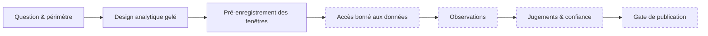

# 🛩️ Case 03 - Interférences GNSS et aviation civile européenne

**Statut : en cours - design analytique gelé avant données réelles.**

> **Question de recherche :** comment les données ouvertes peuvent-elles aider à suivre et caractériser les dégradations de navigation touchant l'aviation civile européenne depuis 2022, sans confondre corrélation, couverture des capteurs et causalité ?

Le travail combine OSINT institutionnel, GEOINT par FIR, data engineering et analyse bornée de trajectoires historiques. Le design actuel impose une séparation stricte entre **observation cinématique ou qualité de données** et toute classification de brouillage, spoofing, interférence GNSS ou attribution.

## Pourquoi geler le design avant les données ?

Définir les fenêtres, les critères et les tests **avant** d'inspecter les observations réelles limite deux biais classiques : choisir les événements qui confirment l'intuition, et ajuster les seuils après coup. Chaque étape d'accès à des données réelles passe par un gate documenté et une approbation humaine explicite.

*En pointillés : étapes non encore franchies dans l'édition publique.*

## Avancement

| Étape | État |
|---|---|
| Question, périmètre, besoins de renseignement | ✅ |
| Design analytique | ✅ gelé |
| Pré-enregistrement de l'accès borné aux données | ✅ gelé |
| Accès aux données réelles | ⏳ sous gates d'autorisation |
| Jugements analytiques | ⏳ non rédigés |
| Publication | ⛔ HOLD |

## Ce que cette page ne contient pas

**Aucune conclusion historique issue de données réelles n'est publiée dans cette première édition.** Aucun identifiant d'aéronef, aucune trajectoire sensible, aucune donnée GPSJAM en volume, aucune fixture synthétique et aucune sortie événementielle ne sont inclus.

Le cas sera ajouté lorsqu'il aura franchi son propre gate de publication.

[← Retour au casebook](../../README.md)
