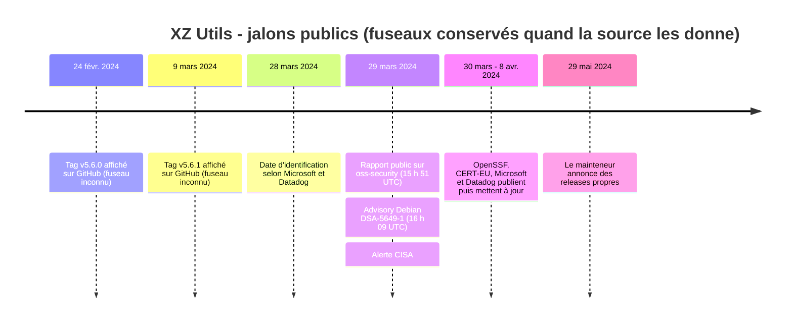

# 🔐 Case 04 - XZ Utils / CVE-2024-3094

**Statut : terminé - édition publique, rapport Markdown.**

[](report.md)
[](sources.md)
[](report.md#2-méthode-de-collecte)
[](citations-ledger.json)

> **Question :** que permettent d'établir les sources publiques sur la chronologie de la compromission de XZ Utils, sa découverte, sa portée technique et la réponse de l'écosystème, sans dépasser les preuves disponibles concernant l'intention, l'identité ou l'attribution ?

Un cas de **compromission de la chaîne d'approvisionnement logicielle** traité en OSINT strictement passif : 12 sources publiques, faits et analyses séparés, contradictions conservées plutôt que lissées, fiabilité des sources et confiance analytique évaluées séparément.

📄 [Rapport](report.md) · 📚 [Sources](sources.md) · 🔗 [Carte des preuves](evidence-map.md) · 🧾 [Provenance](provenance.csv) · 🗂️ [Registre des preuves](evidence-register.md) · ✂️ [Extraits](source-extracts.md) · 🔏 [Ledger de citations](citations-ledger.json)

---

## En deux minutes

- Les sources convergent fortement : les versions **5.6.0 et 5.6.1** contenaient un code malveillant introduit via la **chaîne de publication / build**. **Confiance HIGH.**
- L'impact réel est **segmenté** : Debian situe les paquets compromis dans testing, unstable et experimental ; Red Hat indique que RHEL n'est pas affecté. « Tout Linux était compromis » est une simplification non soutenue.
- Une capacité d'interférence **pré-authentification avec SSH** est décrite sous conditions, mais **aucune exploitation à grande échelle** n'est démontrée par les sources retenues. **Confiance MEDIUM-HIGH.**
- **Aucune attribution** à une personne réelle, un groupe ou un État n'est établie ; la motivation reste inconnue. **Confiance LOW** pour toute attribution spécifique.

## Chronologie



## Hypothèses concurrentes

| Hypothèse | Évaluation | Confiance |
|---|---|---|
| **H1 - compromission délibérée de la chaîne de publication / build** | explication principale : tarballs compromis, versions successives, code obfusqué, conditions de build ciblées | **HIGH** pour l'insertion volontaire ; MEDIUM pour la reconstruction complète |
| H2 - compromission d'un compte ou d'un environnement de mainteneur sans connaissance de l'auteur | conservée comme alternative ; la répétition et la structure des modifications la rendent moins compatible | LOW-MEDIUM |
| H3 - opération organisée ou soutenue par un État | plausible, mais aucune source primaire n'identifie un acteur | LOW - non retenue |

## Contradictions conservées

| ID | Tension | Traitement |
|---|---|---|
| C-001 | 28 mars (Microsoft, Datadog) contre 29 mars (rapport public horodaté) | jalons différents, non départagés |
| C-002 | « Linux largement affecté » contre impact principalement pré-release | segmenter par distribution, canal et build |
| C-003 | contenu du dépôt contre contenu des tarballs | étapes distinctes de la chaîne ; analyse artefact par artefact nécessaire |
| C-004 | capacité technique contre exploitation observée | capacité ≠ exploitation |
| C-005 | motivation et identité | conflit de niveaux de preuve ; attribution LOW |

## Établi / non démontré

| Établi par les sources publiques | Non démontré |
|---|---|
| versions 5.6.0 et 5.6.1 compromises | exploitation réussie à grande échelle |
| mécanisme lié à la chaîne de publication / build et à liblzma | identité réelle derrière le pseudonyme |
| périmètres Debian et Red Hat | périmètre exact de toutes les distributions |
| séquence des releases et des advisories | attribution à un groupe ou à un État |

## Garanties de traçabilité

- Chaque citation de [`citations-ledger.json`](citations-ledger.json) figure **mot pour mot** dans [`source-extracts.md`](source-extracts.md), et chaque référence [n] du rapport pointe vers une source du ledger : c'est vérifié automatiquement par `tools/check_case.py` dans les tests du dépôt.
- Édition publique : seules les URL d'avatar des extraits S-008 / S-009 et une section interne ont été retirées ; aucun fait ni niveau de confiance n'est modifié.
- Aucune tentative d'identification des personnes derrière les pseudonymes, aucun scan, aucune interaction avec des systèmes réels.

## Contenu du dossier

```text
case-04-xz-utils/
├── README.md               # cette synthèse
├── report.md               # rapport complet (pas de PDF pour ce cas)
├── sources.md              # 12 sources, type, fiabilité, dépendances
├── evidence-map.md         # affirmation publique → preuve
├── provenance.csv          # lignée informationnelle de chaque affirmation
├── evidence-register.md    # registre E-001 à E-013, contradictions
├── source-extracts.md      # extraits courts vérifiables
└── citations-ledger.json   # ledger des citations (URL, date d'accès, extrait)
```

[← Retour au casebook](../../README.md)
