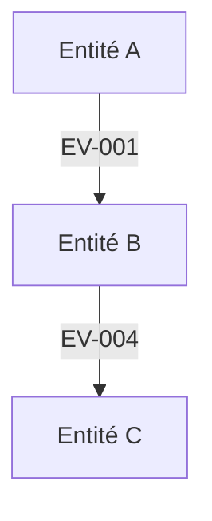
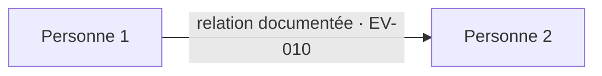
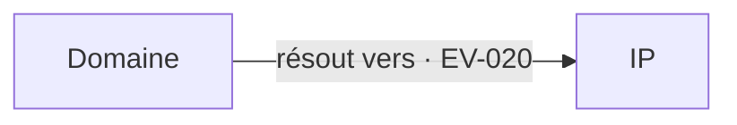

# Modèle complet — ATOM Casebook v2.0

> **Decision-first + Evidence-deep**  
> Ce fichier est un squelette de production. Supprimer les sections non pertinentes plutôt que les remplir artificiellement.

---

# 0. Fiche mission

| Champ | Valeur |
|---|---|
| Titre du cas | [Titre] |
| Audience / décideur | [Qui doit comprendre / décider ?] |
| Question décisionnelle | [Question centrale] |
| Période d'enquête | [AAAA-MM-JJ → AAAA-MM-JJ] |
| Fenêtre des preuves | [Période couverte par les données] |
| Périmètre géographique | [Zone] |
| Entités principales | [Entités] |
| Langues | [Langues] |
| Contraintes de collecte | [Passive / API / archives / datasets / etc.] |
| Contraintes légales / éthiques | [Vie privée / droits / redistribution] |
| Statut | Brouillon / Revue / Publication |
| Version | v0.x / v1.0 |

## PIR — Priority Intelligence Requirements

| ID | Question | Priorité | Statut |
|---|---|---:|---|
| PIR-01 | [Question] | Haute | Ouvert |
| PIR-02 | [Question] | Moyenne | Ouvert |

---

# 1. Executive Intelligence Summary

> **Règle : cette couche doit être compréhensible en moins de 5 minutes. Elle est écrite en dernier.**

## 1.1 Réponse exécutive

[5 à 10 lignes maximum : ce qui s'est passé, pourquoi cela compte, mécanisme dominant, principale incertitude, décision/action.]

## 1.2 Key Judgments

| ID | Jugement clé | Confiance | Preuves principales | Ce qui pourrait changer le jugement |
|---|---|---|---|---|
| KJ-01 | [Une phrase] | Élevée / Moyenne / Faible | EV-001, EV-004 | [Élément discriminant] |
| KJ-02 | [Une phrase] | ... | ... | ... |
| KJ-03 | [Une phrase] | ... | ... | ... |

## 1.3 Réponses aux PIR

| PIR | Réponse synthétique | Confiance | Statut | Références |
|---|---|---|---|---|
| PIR-01 | [Réponse] | ... | Répondu / Partiel / Ouvert | KJ-01, EV-... |

## 1.4 Risques prioritaires

1. **[Risque]** — [impact] — [horizon].
2. **[Risque]** — [impact] — [horizon].
3. **[Risque]** — [impact] — [horizon].

## 1.5 Décisions / actions demandées

- [Action / décision 1]
- [Action / décision 2]
- [Action / décision 3]

## 1.6 Incertitudes critiques

- [Incertitude] → **discriminant :** [preuve qui permettrait de trancher].
- [Incertitude] → **indicateur à surveiller :** [signal].

---

# 2. Périmètre, méthode et limites

## 2.1 Périmètre

[Ce qui est inclus et explicitement exclu.]

## 2.2 Méthode

Chaîne analytique :

```text
Question → PIR → collecte → registre des sources → preuves → chronologie / graphes
→ hypothèses concurrentes → jugements → confiance → risques → recommandations
```

## 2.3 Frontière OSINT / non-OSINT

| Catégorie | Utilisée ? | Exemple | Impact sur reproductibilité |
|---|---|---|---|
| Sources publiques ouvertes | Oui / Non | ... | ... |
| Archives | Oui / Non | ... | ... |
| Données techniques publiques | Oui / Non | ... | ... |
| Jeux de données publics | Oui / Non | ... | ... |
| Matériel fourni par l'utilisateur | Oui / Non | ... | ... |
| Matériel fourni par un exercice | Oui / Non | ... | ... |
| Données privées / fuites | Oui / Non | ... | ... |
| Fixtures / synthétique | Oui / Non | ... | ... |

## 2.4 Limites

- [Source inaccessible]
- [Biais de collecte]
- [Dépendance de sources]
- [Fenêtre temporelle]
- [Droit de redistribution]
- [Incertitude majeure]

---

# 3. Langage analytique

Utiliser si nécessaire :

- **[FAIT]** : directement documenté ou reproductible.
- **[ÉVALUATION]** : interprétation fondée sur plusieurs éléments.
- **[HYPOTHÈSE]** : explication plausible insuffisamment corroborée.
- **[INCONNU]** : données insuffisantes, contradictoires ou indisponibles.

Ne pas confondre :

1. **nature de l'assertion** ;
2. **qualité / fiabilité de la source** ;
3. **niveau de confiance du jugement**.

---

# 4. Registre des sources et preuves

| Source ID | Evidence ID | Description | Date | Collecte | Type | Statut de preuve | Fiabilité | Utilisé pour | Archive / chemin | SHA-256 | Redistribution |
|---|---|---|---|---|---|---|---|---|---|---|---|
| SRC-001 | EV-001 | [Description] | [date] | [date] | [officiel / corporate / social / technique / data] | Observé / Rapporté / Corroboré / Inféré | [optionnel] | KJ-01 / PIR-01 | [URL / fichier] | [hash] | public / derived-only / link-only |

> Dix reprises d'une même source primaire ne constituent pas dix corroborations indépendantes.

---

# 5. Chronologie analytique

| Date / heure | Événement | Evidence ID | Statut | Phase | Signification analytique |
|---|---|---|---|---|---|
| [ISO 8601] | [Événement] | EV-... | Fait / Évaluation / Hypothèse | [Phase] | [Pourquoi cela change la compréhension] |

## 5.1 Phasage

1. **Pré-positionnement** — [éléments]
2. **Approche / reconnaissance** — [éléments]
3. **Action / exploitation** — [éléments]
4. **Consolidation / verrouillage** — [éléments]
5. **Continuation / indicateurs** — [éléments]

---

# 6. Acteurs, entités et relations

## 6.1 Vue capitalistique / propriété



## 6.2 Vue humaine / professionnelle



## 6.3 Vue technique / infrastructure



> Une arête sans preuve identifiable ne doit pas figurer comme relation établie.

---

# 7. Reconstitution par mécanismes / leviers

## Levier A — [Nom]

### Faits établis
- [FAIT] ...

### Évaluation
- [ÉVALUATION] ...

### Effet / fonction probable
[Texte]

### Dépendances
- [Dépendance]

### Preuves clés
- EV-...
- EV-...

### Hypothèse alternative
[Alternative]

### Indicateurs
- [Indicateur]

## Levier B — [Nom]

[Même structure]

## Levier C — [Nom]

[Même structure]

---

# 8. Hypothèses concurrentes

| ID | Hypothèse | Éléments favorables | Éléments contradictoires | Discriminant manquant | Évaluation actuelle |
|---|---|---|---|---|---|
| H1 | [Hypothèse principale] | EV-... | EV-... | [preuve] | Soutenue / Partielle / Non départagée |
| H2 | [Alternative crédible] | ... | ... | ... | ... |

> Ne jamais créer une hypothèse alternative absurde uniquement pour satisfaire la checklist.

---

# 9. Signaux faibles, anomalies et questions ouvertes

| ID | Observation | Pourquoi cela compte | Ce qui n'est PAS établi | Prochaine preuve utile |
|---|---|---|---|---|
| WS-01 | [Signal] | [Intérêt] | [Limite] | [Discriminant] |

**Règle :** l'accumulation narrative n'augmente pas à elle seule la force probatoire.

---

# 10. Vulnérabilités exploitées / exposées

| ID | Vulnérabilité | Vecteur | Impact | Probabilité | Criticité | Evidence ID |
|---|---|---|---|---|---|---|
| V-01 | [Vulnérabilité] | [Vecteur] | Fort | Moyenne | Haute | EV-... |

---

# 11. Conséquences et risques

## Immédiat
- [Risque] — [Impact] — [Indicateur]

## Court terme
- [Risque] — [Impact] — [Indicateur]

## Moyen terme
- [Risque] — [Impact] — [Indicateur]

## Long terme
- [Risque] — [Impact] — [Indicateur]

## Effets de second ordre
- [Conséquence indirecte]

---

# 12. Recommandations traçables

| Priorité | Horizon | Action | Objectif | Porteur | Condition / déclencheur | Traçabilité |
|---|---|---|---|---|---|---|
| P0 | Immédiat | [Verbe + objet] | [Risque réduit] | [Responsable] | [Si / lorsque] | KJ-01 / V-01 / EV-... |
| P1 | Court terme | ... | ... | ... | ... | ... |
| P2 | Moyen / long terme | ... | ... | ... | ... | ... |

Une recommandation sans **action**, **objectif**, **porteur** et **raison issue de l'analyse** est incomplète.

---

# 13. Conclusion

[5 à 10 lignes maximum.]

Inclure :

- jugement principal ;
- confiance ;
- mécanisme dominant ;
- incertitude principale ;
- décision la plus importante.

Ne pas introduire de nouvelle preuve.

---

# 14. Annexes

## Annexe A — Observables / indicateurs

- domaines ;
- IP ;
- handles ;
- sociétés ;
- références documentaires ;
- wallets ;
- coordonnées ;
- hashes ;
- autres identifiants pertinents.

## Annexe B — Evidence Map

| Claim / Judgment | Evidence | Transformation | Limite | Confiance |
|---|---|---|---|---|
| KJ-01 | EV-001, EV-004 | [méthode] | [limite] | Élevée |

## Annexe C — Journal analytique

| Date | Hypothèse / piste | Action | Résultat | Décision |
|---|---|---|---|---|
| [date] | [piste] | [test] | [résultat] | poursuivie / abandonnée |

## Annexe D — Provenance et reproductibilité

- versions de datasets ;
- dates de snapshot ;
- scripts ;
- paramètres ;
- transformations ;
- checksums ;
- droits de redistribution.

---

# 15. Red Team Gate

Répondre avant gel :

1. Quel Key Judgment est le plus fragile ?
2. Quel fait unique, s'il était faux, affaiblirait le plus l'analyse ?
3. Quelle explication alternative est la plus simple ?
4. Où risque-t-on de confondre corrélation, simultanéité et causalité ?
5. Quelle source porte trop de poids ?
6. Quel détail intéressant ne change aucune décision et devrait passer en annexe ?
7. Quelle phrase paraît plus certaine que les preuves ?
8. Quelle recommandation n'est pas reliée à un constat ?
9. Quelle nouvelle preuve ferait changer le niveau de confiance ?
10. Le décideur comprend-il l'essentiel sans lire les annexes ?

---

# 16. Public Release Gate

- [ ] aucune donnée sensible inutile ;
- [ ] aucune clé, secret, token ou chemin privé ;
- [ ] données personnelles minimisées ;
- [ ] droits de redistribution respectés ;
- [ ] link-only / derived-only appliqué quand nécessaire ;
- [ ] toutes les affirmations majeures sont traçables ;
- [ ] faits, évaluations, hypothèses et inconnues sont séparés ;
- [ ] incertitudes visibles ;
- [ ] hypothèses concurrentes testées ;
- [ ] lecture décisionnelle ≤ 5 minutes ;
- [ ] recommandations reliées aux constats ;
- [ ] figures lisibles et sourcées ;
- [ ] Markdown / PDF cohérents ;
- [ ] manifestes / checksums rafraîchis si requis ;
- [ ] assistance IA documentée selon la politique du dépôt.

## Verdict publication

**PASS / HOLD**

Motifs :
- [...]
